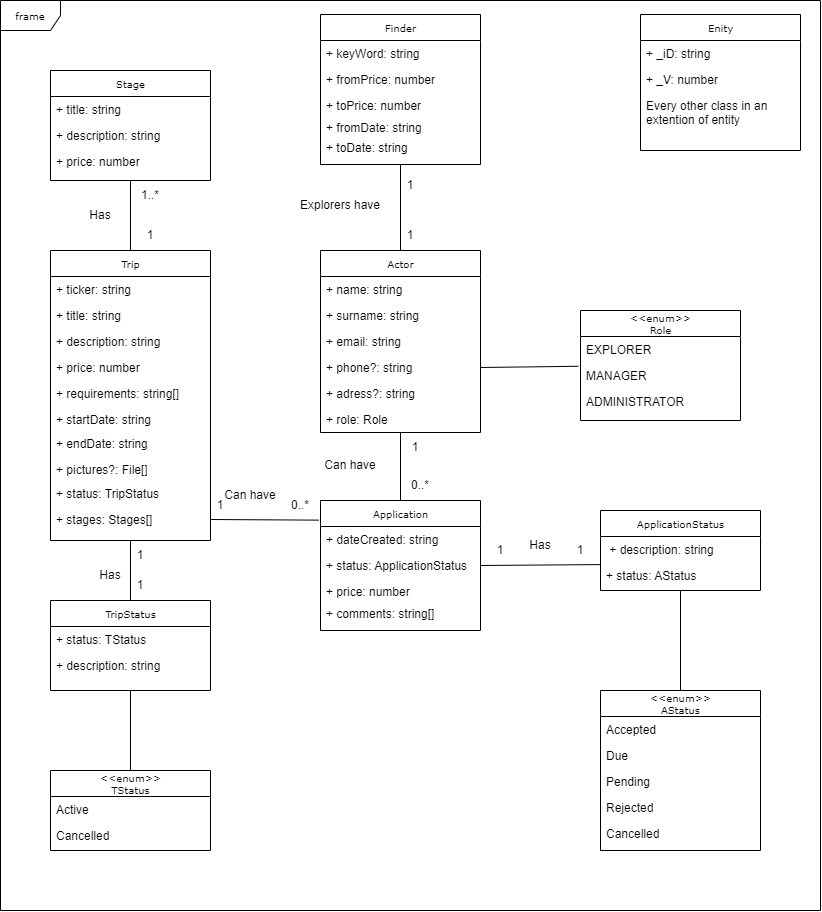

# Acme Frontend

Students: Ole Løkken, Mathias Myrold, Håvard Tysland(XRJ9349)

## Content

- [Assumptions and decisions](#assumptions-and-decisions)
- [User Authorization](#user-authorization)
- [Running the application](#running-the-application)
- [Testing the application](#testing-the-application)
- [UML Diagram](#uml-diagram)

## Assumptions and decisions

This section discusses assumptions and decisions the group has made regarding the delivery requirements.

- As the backend requirements did not have any field in a trip called "publish-date", this was not implemented into the application.
- As a trip cannot be edited or deleted when there is less than 10 days until the start date, the group has assumed that a trip also can only be created minimum 10 days ahead of the start date aswell.

## User Authorization

This section includes some users with different levels of authorization:

#### <u>Administrator</u>

E-mail: admin@mail.com\
Password: 12345678

#### <u>Manager</u>

E-mail: manager@mail.com\
Password: 12345678

#### <u>Explorer</u>

E-mail: explorer@mail.com\
Password: 12345678

## Running the application

The backend is already deployed, and the swagger documentation can be seen at https://acme.exigo.dev/docs. Therefore, to run the whole application all the steps needed are:

1. Navigate to the root of the project.
2. Run `npm install` to download all the packages the project are dependant on.
3. Run `npm start` to start the application.
4. Open http://localhost:4200 in the browser of your choice.

## Testing the application

We have created a cypress test (tripsearch-spec-cy.ts), and you can do the test by running: `npm run e2e`. The test is an end-to-end test that uses the deployed backend. We could have mocked the response but wanted to do a real end-to-end test to check if everything is working as it should. Because we only have deployed the backend in one environment, it could happen that the data we are checking has been modified or deleted. For the test to succeed it is important that Trip with ID: 645e6a10ea4c72e815eaede4 exists and have the same values as when the test was written.

For the functional tests they can be run by writing `npm test`.\
 This involes:

- Creating a trip that should be created
- Creating a trip that has end date before start date should not work because of disabled button
- Applying for a trip that should go through
- Applying for a trip that has started should not work because of disabled button

## UML Diagram

